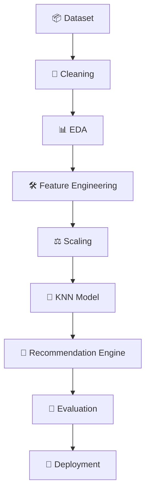

<div align="center">

# 📚 Goodreads Book Recommendation System

### An intelligent, content-based recommendation engine powered by KNN & cosine similarity

<p>
  
  
  
  
</p>

<p>
  
  
  
  
</p>

**[Explore the docs »](#-project-overview)** · **[Report Bug](#)** · **[Request Feature](#)**

</div>

<br>

---

## 📖 Table of Contents

- [Overview](#-project-overview)
- [Features](#-features)
- [Dataset](#-dataset)
- [Workflow](#-project-workflow)
- [Tech Stack](#-technologies-used)
- [Feature Engineering](#-feature-engineering)
- [ML Pipeline](#-machine-learning-pipeline)
- [Example](#-example)
- [Repository Structure](#-repository-structure)
- [Installation](#-installation)
- [Usage](#-run-the-app)
- [Results](#-results)
- [Roadmap](#-future-improvements)
- [Author](#-author)
- [License](#-license)

---

## 🎯 Project Overview

This project implements a **content-based recommendation system** that suggests books similar to a user's selected title — no user-interaction history required.

Instead of relying on collaborative filtering, recommendations are generated using engineered metadata features including:

| Feature | Description |
|---|---|
| ⭐ **Average Rating** | Mean user rating for the book |
| 🔢 **Rating Count** | Total number of ratings received |
| 💬 **Review Count** | Total number of written reviews |
| 📄 **Number of Pages** | Physical length of the book |
| 🌐 **Language** | Original publication language |
| 🏷️ **Rating Category** | Binned rating tier (e.g., Low / Medium / High) |
| 📚 **Book Length Category** | Binned page-count tier (e.g., Short / Medium / Long) |
| 🔥 **Popularity Score** | Composite engagement metric |

The project uses **K-Nearest Neighbors (KNN)** with **cosine similarity** to retrieve the most similar books in the feature space.

---

## ✨ Features

- 📦 Goodreads Dataset integration via KaggleHub
- 🧹 Complete data cleaning pipeline
- 📊 Exploratory Data Analysis (EDA)
- 🛠️ Feature engineering & scaling
- 🤖 KNN-based recommendation engine
- 🔍 Fuzzy title search (typo-tolerant)
- 📈 Recommendation similarity scores
- 💾 Model serialization for reuse
- 🧪 Evaluation metrics
- 🚀 Deployment-ready structure

---

## 🗂️ Dataset

**Source:** [Goodreads Books Dataset](https://www.kaggle.com/datasets/jealousleopard/goodreadsbooks)

Downloaded programmatically using `kagglehub`:

```python
import kagglehub

kagglehub.dataset_download(
    "jealousleopard/goodreadsbooks"
)
```

---

## 🔄 Project Workflow



---

## 🧰 Technologies Used

<p>
  
  
  
  
  
  
  
  
  
</p>

---

## 🛠️ Feature Engineering

The recommendation model uses the following engineered features:

- Average Rating
- Rating Count
- Text Review Count
- Number of Pages
- Popularity Score
- Review Density
- Language Encoding
- Rating Category Encoding
- Page Category Encoding

---

## 🤖 Machine Learning Pipeline

<div align="center">

| Step | Stage |
|:---:|---|
| 1️⃣ | Load Dataset |
| 2️⃣ | Clean Dataset |
| 3️⃣ | Handle Missing Values |
| 4️⃣ | Remove Duplicates |
| 5️⃣ | Engineer Features |
| 6️⃣ | Scale Numerical Features |
| 7️⃣ | Encode Categorical Variables |
| 8️⃣ | Train KNN Model |
| 9️⃣ | Generate Recommendations |
| 🔟 | Evaluate Model |

</div>

---

## 💡 Example

**Input:**

```
Harry Potter and the Half-Blood Prince
```

**Output:**

```
1. Harry Potter and the Order of the Phoenix
2. Harry Potter and the Prisoner of Azkaban
3. The Fellowship of the Ring
4. The Lightning Thief
5. Harry Potter and the Chamber of Secrets
```

---

## 📁 Repository Structure

```
goodreads-book-recommendation-system/
├── 📂 app/            # Application entry point / deployment code
├── 📂 assets/         # Images, diagrams, and static assets
├── 📂 data/           # Raw and processed datasets
├── 📂 evaluation/     # Evaluation scripts and metrics
├── 📂 models/         # Serialized models (joblib/pickle)
├── 📂 notebooks/      # Jupyter notebooks (EDA, experimentation)
├── 📂 src/            # Core source code (cleaning, features, model)
├── 📄 README.md
└── 📄 requirements.txt
```

---

## 🚧 Future Improvements

- [ ] Sentence Transformer embeddings for semantic similarity
- [ ] Hybrid recommendation system (content + collaborative)
- [ ] Collaborative filtering module
- [ ] Deep learning based embeddings
- [ ] Streamlit web application
- [ ] Docker deployment
- [ ] FastAPI REST API

---

## 📊 Results

- ✅ Cosine similarity based retrieval
- ⚡ Fast recommendation generation
- 🔍 Fuzzy book search (handles typos & partial titles)
- 🧩 Modular architecture
- 🔧 Easily extendable

---

## ⚙️ Installation

```bash
# Clone the repository
git clone https://github.com/yourusername/goodreads-book-recommendation-system.git

# Navigate to the project directory
cd goodreads-book-recommendation-system

# Install dependencies
pip install -r requirements.txt
```

---

## ▶️ Run the App

```bash
python app/app.py
```

---

## 👤 Author

<div align="center">

**Your Name**

<p>
  <a href="#"></a>
  <a href="#"></a>
  <a href="#"></a>
</p>

</div>

---

## 📄 License

This project is licensed under the **MIT License** — see the [LICENSE](LICENSE) file for details.

<div align="center">

---

### ⭐ If you found this project useful, consider giving it a star!

</div>
